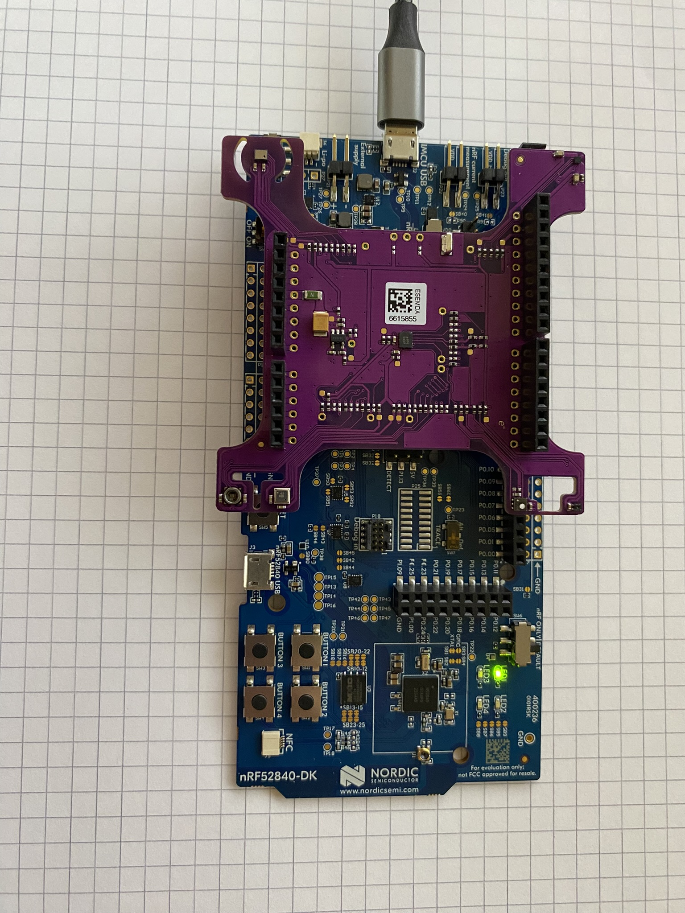
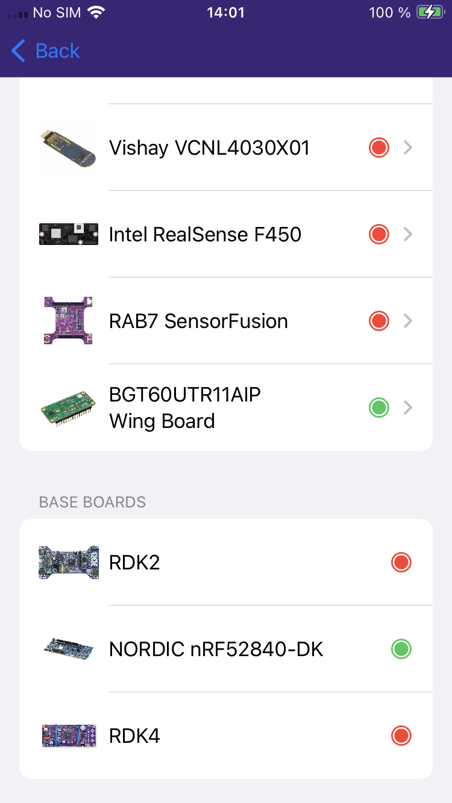
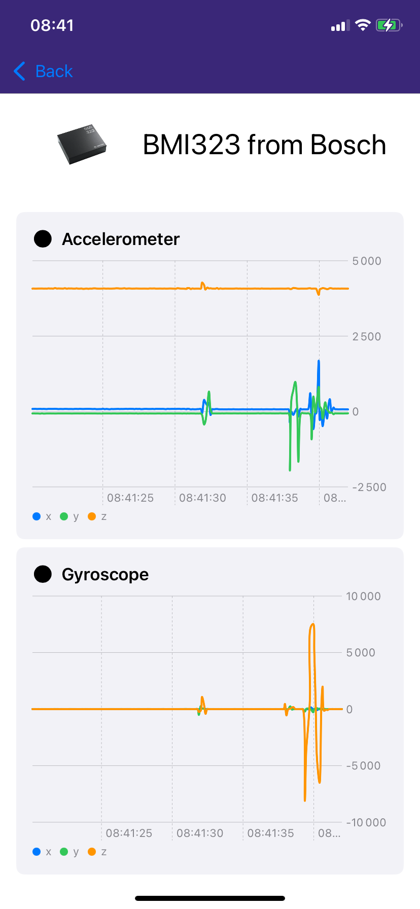

# NRF52840-DK / RAB7 SensorFusion

This project enables to demonstrate how to use the RAB7 SensorFusion board with a nRF52840-DK from Nordic.

## Required hardware

- [nRF52840-DK](https://www.rutronik24.fr/produit/nordic/nrf52840dk/10422794.html)
- [RAB7 SensorFusion](https://www.rutronik24.fr/produit/rutronik/rab7sensorfusion/24886398.html)

## Some screenshots from the iOS App

## Legal Disclaimer

The evaluation board including the software is for testing purposes only and, because it has limited functions and limited resilience, is not suitable for permanent use under real conditions. If the evaluation board is nevertheless used under real conditions, this is done at one’s responsibility; any liability of Rutronik is insofar excluded. 

